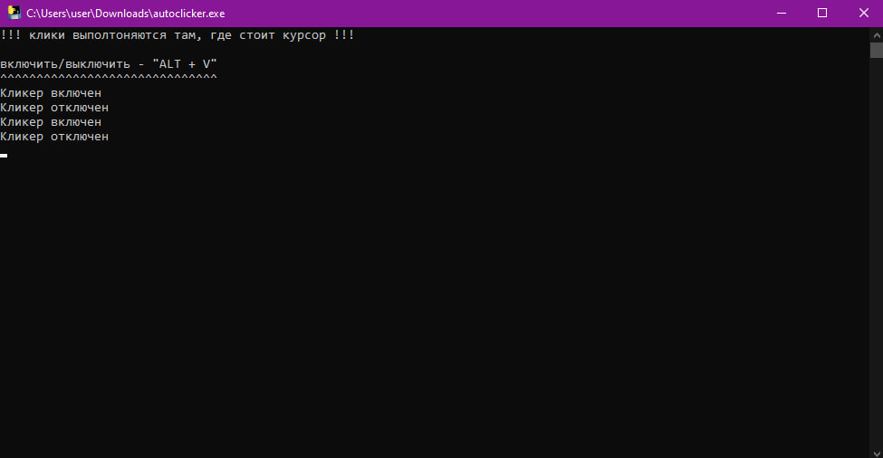

# autoclicker 

> [!IMPORTANT]
> <b align="center">автокликер от Spucme с открытым кодом.</b> код полностью открытый - т.е. можно брать и использовать в своих целях.

> [!IMPORTANT]
> <b align="center">перед тем как взять код, подпишитесь на мой тгк! <a href="https://t.me/two_koders">клик</a></b>  
> мой телеграм для связи - <a href="https://t.me/spucme">клик</a>

<b text-align="center"> в качестве благодарности, можете отметить автора кода + подписаться на мой гитхаб (этот).</b>

> # дополнительно
> простой автокликер написаный за пару минут. надеюсь сможет чем-то помочь некоторым

## фото проекта (ПК):

      

